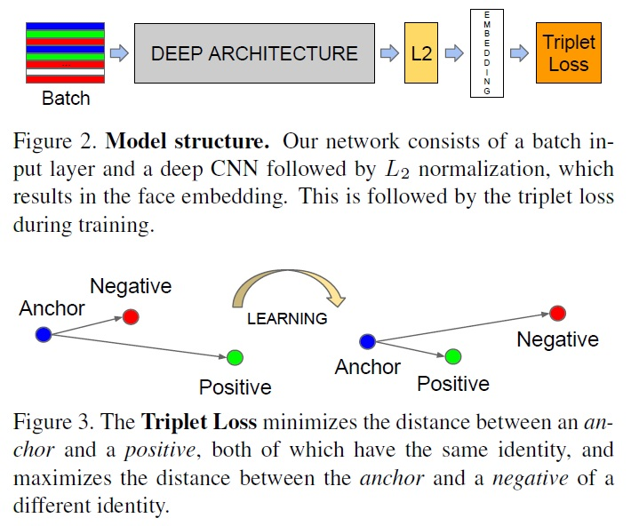
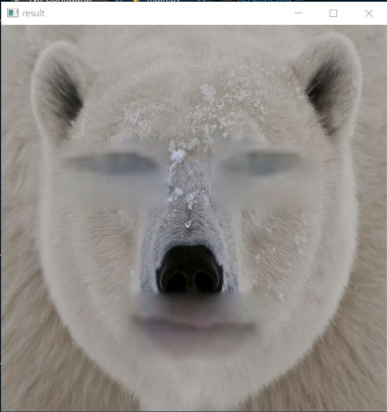

eyes and mouth are paste to the other thing.

## FaceNet

- DEEP ARCHITECTURE: GoogLeNet의 Inception module을 사용
- L2 Nomalization: 데이터 값의 분포 범위가 넓어지면 노이즈가 생성되기 쉽고 Overfitting이 일어나기 쉽기 때문에 Compact하게 만들어주기 위해서 사용
- Embedding: 128차원으로 임베딩된 값
- Triplet Loss: 임베딩 값을 입력받으면 현재 배치 안에서 어떤 사람(Anchor)에 대해 같은 사람(Positive)와 다른 사람(Negative)를 지정하고 각각의 유클리드 거리를 구해 Positive와의 거리는 가까워지게, Negative는 멀어지도록 학습되게 한다.

## Result

[reference]
- https://github.com/timesler/facenet-pytorch#guide-to-mtcnn-in-facenet-pytorch
- https://www.youtube.com/watch?v=9VYUXchrMcM
- https://hwangtoemat.github.io/paper-review/2020-04-02-FaceNet-%EB%82%B4%EC%9A%A9/