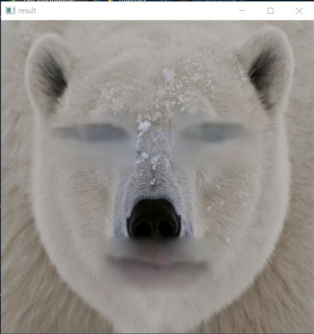

eyes and mouth are paste to the other thing.

[reference]
- https://github.com/timesler/facenet-pytorch#guide-to-mtcnn-in-facenet-pytorch
- https://www.youtube.com/watch?v=9VYUXchrMcM
- https://hwangtoemat.github.io/paper-review/2020-04-02-FaceNet-%EB%82%B4%EC%9A%A9/